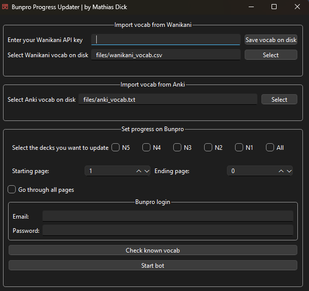

# Bunpro Progress Updater

**Bunpro Progress Updater** is a desktop application designed to help Japanese language learners efficiently master vocabulary on the **Bunpro** platform, with additional support for **Wanikani** and **Anki** vocab imports. This tool enables users to import vocab lists, manage and automate vocabulary mastery on Bunpro using a simple GUI.

## Features

- **Vocabulary Import from Wanikani API and Anki**: Import vocabulary lists directly from Wanikani using an API key or load from an Anki text file.
- **Automated Progress Update on Bunpro**: Select JLPT levels (N5 to N1) to mark vocabulary items as mastered.
- **User-Friendly Interface**: Built using PySide6, providing a clean and intuitive GUI for easy navigation.
- **Selenium Integration for Web Automation**: Automates login and vocabulary updates on Bunpro, saving users significant time and effort.

## Table of Contents

1. [Installation](#installation)
2. [Usage](#usage)
3. [Screenshots](#screenshots)
4. [Project Structure](#project-structure)
5. [Troubleshooting](#troubleshooting)

## Installation

### Prerequisites

- **Python 3.8+**
- **pip** (Python package manager)
- **Chrome WebDriver**: Required for Selenium automation (ensure it matches your Chrome browser version).

### Clone the Repository

To clone this repository, run:

```bash
git clone https://github.com/yourusername/bunpro-progress-updater.git
cd bunpro-progress-updater
```

### Install Dependencies
```bash
pip install -r requirements.txt
```

Make sure `Chrome WebDriver` is installed and accessible in your PATH. You can download it from [here](https://sites.google.com/a/chromium.org/chromedriver/downloads).

## Usage

To use the application, follow these steps:

1. **Start the Application**: Run the following command:
   ```bash
   python bunpro.py
   ````

2. **Using the Interface**:
   - **Wanikani API Import**:
     - Enter your Wanikani API key and click on **Save vocab on disk** to fetch and save vocab as a CSV file.
     - Or, load an existing Wanikani CSV file by clicking **Select**.
   - **Anki Import**:
     - Load an Anki vocab file by clicking **Select** in the Anki section.
   - **Set Progress on Bunpro**:
     - Select the desired JLPT levels you want to update and specify the **Starting page** and **Ending page**.
     - Enable **Go through all pages** if you want to mark all pages in the selected JLPT levels.
   - **Bunpro Login**:
     - Enter your Bunpro login credentials and start the bot by clicking **Start bot**.
   - **Check Known Vocabulary**:
     - Use this button to view the vocabulary list you’re about to mark as mastered on Bunpro.

3. **Automated Process**:
   - Once configured, the bot will log in to Bunpro, navigate to the selected vocabulary decks, and mark items as mastered based on your imported vocabulary lists.

## Screenshots

### Main Interface


## Video Demonstration

If you’d like to see a demonstration of how the **Bunpro Progress Updater** works, check out this video:

[Watch the Video Demonstration](https://www.youtube.com/watch?v=GxD2Ec5oDJE)


## Project Structure

The project folder structure is as follows:

```plaintext
bunpro-progress-updater/
├── bunpro.py                 # Main application file
├── web_interaction.py        # Handles web automation with Selenium
├── UI/                       # Folder containing UI files
│   ├── Bunpro_Form.ui        # GUI layout for the main window (generated by PySide6 Designer)
│   └── Vocab_list.ui         # GUI layout for the vocabulary window
├── anki_vocab.txt            # Sample Anki vocabulary file
├── requirements.txt          # Required Python packages
└── README.md                 # Project documentation (this file)
```


## Troubleshooting

- **Selenium WebDriver Issues**: Ensure that Chrome WebDriver is installed and matches your Chrome browser version. Add it to your PATH or place it in the project directory.
- **Wanikani API Errors**: Double-check your API key and ensure it's valid.
- **Bunpro Login Issues**: Verify login credentials. Check Bunpro's site status if issues persist, as occasional maintenance may interrupt automation.


